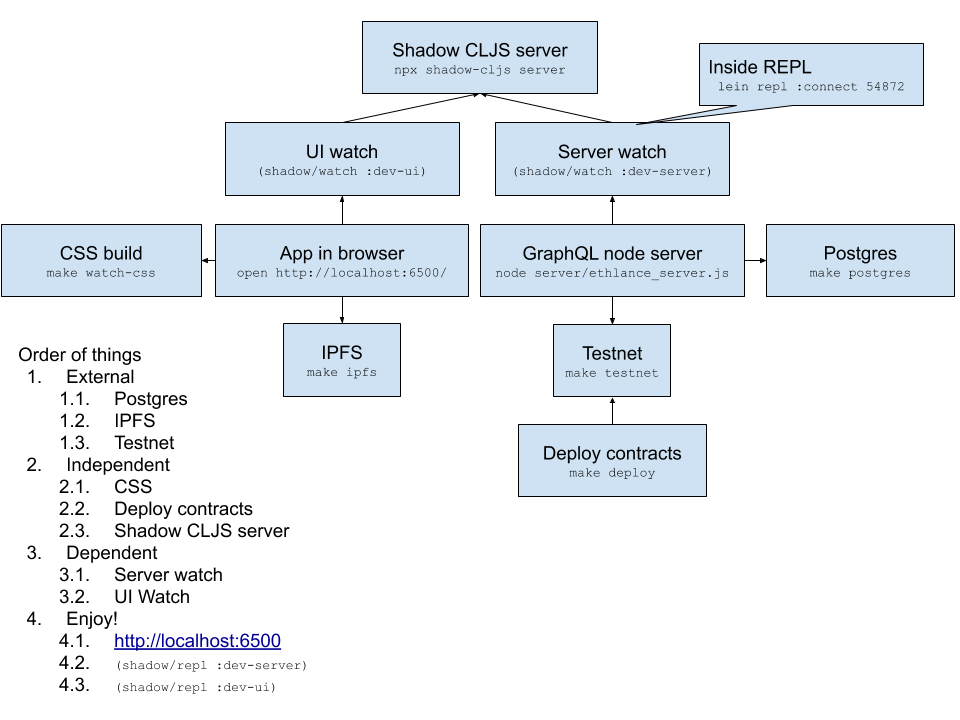

# Ethlance V.2 (Newlance)

[](https://circleci.com/gh/district0x/ethlance/tree/newlance)

*Ethlance Version 2 is Currently in Development and is subject to
change before final release*

# Development

Here's a high level overview of the components involved in ethlance.



## Prerequisites

The following tools are needed to run different parts making up the Ethlance
service.  Programming language tools (e.g. nodejs, python, etc.) may require
specific versions.  To simplify maintaining their versions,
[asdf](https://github.com/asdf-vm/asdf) version manager is a good tool Ethlance
project also has `.tool-versions` described with appropriate versions

* [NodeJS](https://nodejs.org) (Latest LTS Version)
* [Leiningen](https://leiningen.org/)
* [ganache-cli](https://github.com/trufflesuite/ganache-cli)
* [ipfs](https://docs.ipfs.io/introduction/install/)
* make
  * Note: Windows users can use Msys for build essentials (Untested)

Run `make check` to determine whether you are missing any prerequisites

## Setup Backend

Backend development requires:

1. Postgres database server (provided by docker image)
2. IPFS server running
3. Ganache test net running
  * Contracts deployed to testnet
4. CSS files to be watched & compiled
5. Node.js server with Shadow CLJS for back-end running
6. Node.js server with Shadow CLJS for front-end running
7. Node.js server for GraphQL running

This is quite a few steps to run every time you start developing.
To simplify that, a `Procfile` consuming tool like [Foreman](https://github.com/jmoses/foreman)
(has implementations in various languages) or [Invoker](https://invoker.codemancers.com/) can be used.

Then it's easy as
```
❯ foreman start
08:37:22 postgres.1         | started with pid 205427
08:37:22 ipfs.1             | started with pid 205428
08:37:22 testnet.1          | started with pid 205429
08:37:22 deploy_contracts.1 | started with pid 205433
08:37:22 css.1              | started with pid 205434
08:37:22 ui.1               | started with pid 205436
08:37:22 server.1           | started with pid 205439
08:37:22 graphql.1          | started with pid 205442
08:37:22 postgres.1         | docker run                                                       \
08:37:22 ipfs.1             | ipfs daemon
08:37:22 testnet.1          | npx ganache-cli -m district0x --host 0.0.0.0 --port 8549  -l 8000000
08:37:22 css.1              | ./ui/node_modules/less/bin/lessc resources/public/less/main.less resources/public/css/main.css
08:37:22 postgres.1
<...>
```

### Initial Setup

*Note: All instructions start in the root of the project directory*

If this is a first time setup, or you accidentally ran `make
clean-all`, you are required to re-install additional node
dependencies with:

**Tested with GCC 6 & GCC 7, does not appear to work with GCC 8**

```bash
make deps
```

If you're having issues with your environment, you can run this command:

```bash
make clean-all deps
```

### First steps, showing example data

In order for the front-end to be able to have the JWT token (kept in LocalStorage), you must sign a transaction. Currently it can be done manually. Open REPL for UI:
```
lein repl :connect 54872
(shadow/repl :dev-ui)
(in-ns 'ethlance.ui.event.sign-in)
(re/dispatch [:user/sign-in])
```
  - this will show a pop up and using MetaMask you can create a transaction
  - after doing this successfully the UI graphql requests will have proper `Authorization: Bearer ...` header

Then to generate some example data you can use server REPL:
```
lein repl :connect 54872
(shadow/repl :dev-server)
(in-ns 'tests.graphql.generator)
(generate-for-address "0xafcf1a2bc71acf041c93012a2e552e31026dfeab")
```
  - for that the test namespace must be included in the server build (e.g. by adding `[tests.graphql.generator :as test-data-generator]` to `ethlance.server.core`)
  - alternatively you can submit the data manually through the forms

#### Additional Troubleshooting

- Make sure you are using NodeJS LTS Version. (Latest LTS Version is
  v10.16.3 as of this posting)

- GCC 8+ do not work with some of the district libraries. This might
  change in the future. Please use GCC Version 6, or GCC Version 7.

### Testnet Server

Our local development environment requires a testnet in order to run
smart contracts. Ethlance Development uses ganache-cli with a default
configuration.

```bash
$ make testnet # Run in a separate terminal
```

### IPFS Server

IPFS is an essential technology in ensuring that large blobs of data
can be stored in a decentralized manner. After installing the `ipfs`
commandline tool, you need to start up a daemon for development

```bash
ipfs daemon
```

**Note**: Might require additional configuration for CORS

```bash
ipfs config --json Gateway.HTTPHeaders.Access-Control-Allow-Methods '["PUT", "GET", "POST", "OPTIONS"]'
ipfs config --json Gateway.HTTPHeaders.Access-Control-Allow-Origin '["*"]'
ipfs config --json Gateway.HTTPHeaders.Access-Control-Allow-Headers '["X-Requested-With"]'
ipfs config --json Gateway.Writable true
```

# Deployment

Ethlance product can be prepared for deployment by running:

```bash
$ make build
```

This compiles everything and places it in the *./dist* folder

After building, the production build can be run:

```bash
$ make run
```

# Testing One-touch

To run all of the tests in a standalone test runner, you must first
build the solidity contracts, run an instance of the testnet server,
and an instance of the IPFS daemon. The test runner can be run via:

1. Watch test build (compiles test CLJS files)
  - `./bin/repl-run "(shadow/watch :server-tests) @(promise)"`
2. Run tests:
  - `node server/tests/server-tests.js`

# Contributing

Anyone is welcome to contribute to the ethlance project, here are some brief guidelines:

* Make sure to squash your commits
* Reference issue numbers in your pull request
* Rebase your changes on upstream (`git remote add upstream
  https://github.com/madvas/ethlance.git`) master before pushing  (`git pull --rebase upstream master`)
* Make changes in a separate well-named branch in your forked repo
  like `improve-readme`
